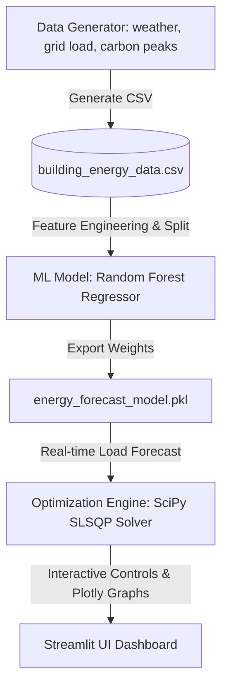

# VoltShift: Smart Energy & Carbon Scheduler

**VoltShift** (also featured as ** Green Energy Saver**) is an end-to-end Machine Learning and Numerical Optimization platform designed to optimize commercial building energy consumption. By combining time-series forecasting with mathematical optimization, VoltShift shifts flexible energy loads (like HVAC cooling/heating and EV charging) to hours of the day when the electricity grid is both cheaper and cleaner.

---

## System Architecture & How It Works

VoltShift operates in a closed-loop pipeline across three main stages:



### 1. Data & Feature Engineering (`data_generator.py`)
Generates 1 year of hourly synthetic data modeling:
* **Outdoor Temperature**: Seasonal sine wave with random noise.
* **HVAC Loads**: Temperature-dependent cooling (above 22°C) and heating (below 18°C).
* **Electricity Pricing**: Peak hours ($0.25/kWh between 2 PM - 8 PM) vs off-peak ($0.08/kWh).
* **Grid Carbon Intensity**: Baseline load (coal/gas) offset by solar peaks (noon to 4 PM) which drops carbon intensity.

### 2. Machine Learning Forecasting (`model.py`)
Trains a **Random Forest Regressor** to predict hourly energy consumption.
* **Features**: Outdoor Temperature, Hour of Day, Day of Week, Month, IsWeekday.
* **Target**: Total Building Energy Load ($kWh$).
* **Evaluation**: Reaches high accuracy ($R^2 \approx 99.5\%$), capturing complex thermodynamic dependencies of HVAC systems without needing linear assumptions.

### 3. Constrained Optimization (`optimizer.py`)
Splits predicted load into **80% non-flexible** (lighting, computers) and **20% flexible** (HVAC pre-cooling, battery storage charging). It runs a **Sequential Least Squares Programming (SLSQP)** optimizer from `scipy.optimize` to shift the flexible energy slice.

#### Optimization Formulation:
$$\min_{x} \quad \sum_{t=1}^{24} \left( w \cdot x_t \cdot \hat{P}_t + (1-w) \cdot x_t \cdot \hat{C}_t \right)$$

Subject to:
$$\sum_{t=1}^{24} x_t = \sum_{t=1}^{24} L_{t,\text{flex}} \quad \text{(Energy conservation constraint)}$$
$$0 \leq x_t \leq 1.8 \cdot L_{t,\text{flex}} \quad \text{(Maximum hourly grid capacity constraint)}$$

Where:
* $x_t$: Optimized flexible load at hour $t$.
* $L_{t,\text{flex}}$: Baseline flexible load at hour $t$.
* $\hat{P}_t, \hat{C}_t$: Normalized electricity price and carbon intensity (mean-centered).
* $w$: User priority slider value ($0.0 \le w \le 1.0$) balancing Wallet (cost) vs Earth (carbon emissions).

---

## Dashboard Features

* **Control Room (Main Dashboard)**: Real-time telemetry displaying Money Saved ($), Carbon Prevented (kg $CO_2$), and Peak Grid Load Reduction (%), backed by interactive Plotly charts showing optimized vs baseline consumption.
* **How the AI Decides (XAI)**: Visualizes the impact of the priority weights and pricing/carbon curves on load shifting behavior.
* **Developer Journal**: Comprehensive development log highlighting key architectural design choices, engineering compromises, and mathematical takeaways.

---

## Setup & Running Locally

### 1. Initialize Virtual Environment (Windows)
```powershell
# Create venv if not already created
python -m venv venv

# If Execution Policies restrict activation, run Python/Pip directly from venv path:
.\venv\Scripts\python.exe -m pip install -r requirements.txt
```

### 2. Generate Data & Train Model
```powershell
# Generate the synthetic historical dataset
.\venv\Scripts\python.exe data_generator.py

# Train the Random Forest forecasting model
.\venv\Scripts\python.exe model.py
```

### 3. Run Streamlit Dashboard
```powershell
.\venv\Scripts\streamlit.exe run app.py
```

---
